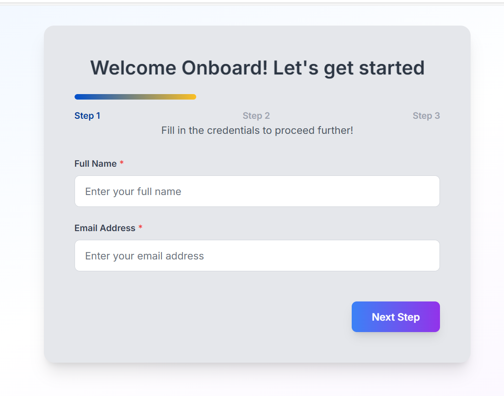
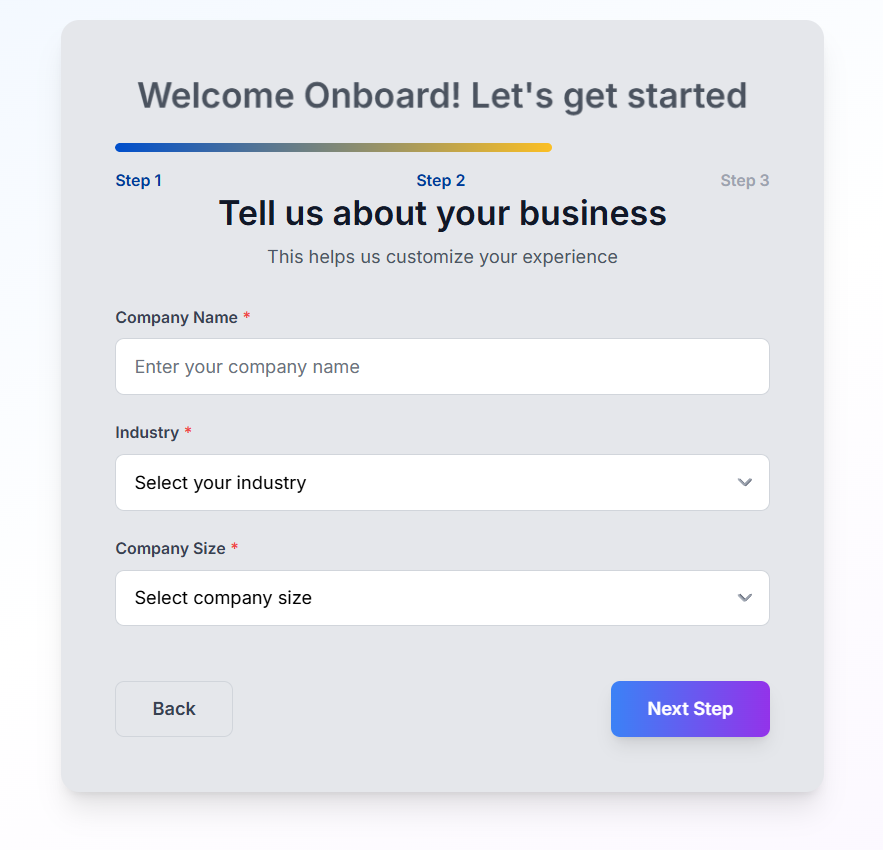
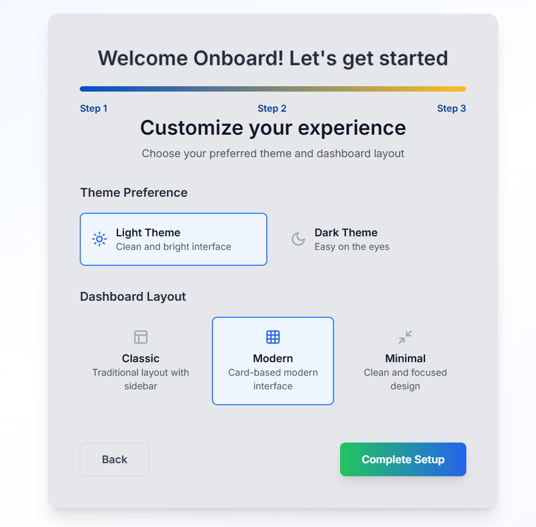
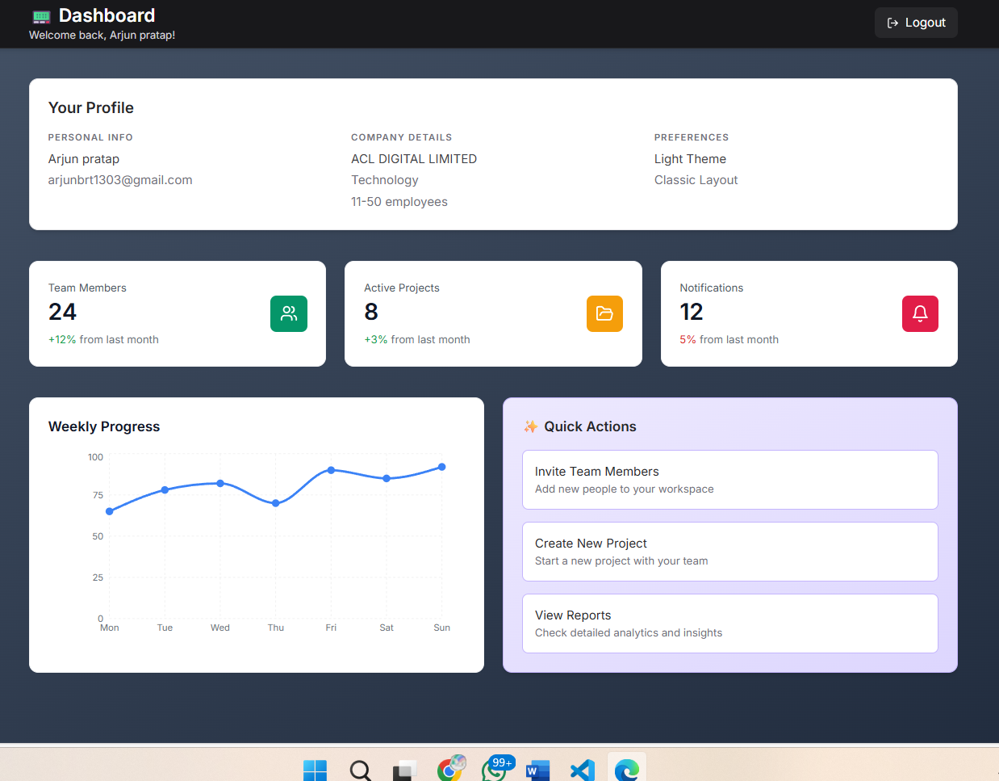
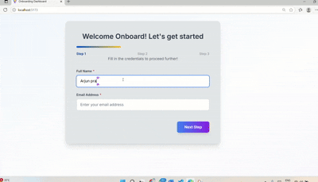

# A fictional onboarding platform that helps teams manage projects, people, and productivity

A responsive multi-step onboarding flow built using **React**, **TypeScript**, **Tailwind CSS**, and **React Router**. It collects user information across steps and saves it locally, simulating a real-world onboarding experience.

---

## Tech Stack we have used:

-  React (with Vite)
-  TypeScript
-  Tailwind CSS
-  React Router DOM
-  LocalStorage (for persistence user data in case the user refeshes or goes bac to home page, the data remains intact)

---

##  Setup Instructions

1. **Clone the repository**  
https://github.com/arjun9978/Frontend_OnboardingPage.git
   
2. **Change the directory**
   
cd Frontend_OnboardingPage
---

## Install dependencies

npm install

## Run the app

npm run dev

---

# Folder Structure (Simplified)
<pre> 
 src/
├── components/
│ ├── Dashboard/
│ │ ├── StatsCard.tsx
│ │ └── WeeklyChart.tsx
│ ├── steps/
│ │ ├── PersonalInfoStep.tsx
│ │ ├── BusinessInfoStep.tsx
│ │ └── PreferencesStep.tsx
│ ├── Dashboard.tsx
│ ├── FormInput.tsx
│ ├── FormSelect.tsx
│ ├── Onboarding.tsx
│ └── ProgressBar.tsx
│
├── context/
│ └── UserContext.tsx
│
├── types/
│ └── user.ts
│
├── App.tsx
├── main.tsx
├── index.css
└── README.md
     </pre>

---

## Screenshots of the page

---

## Video of the page

